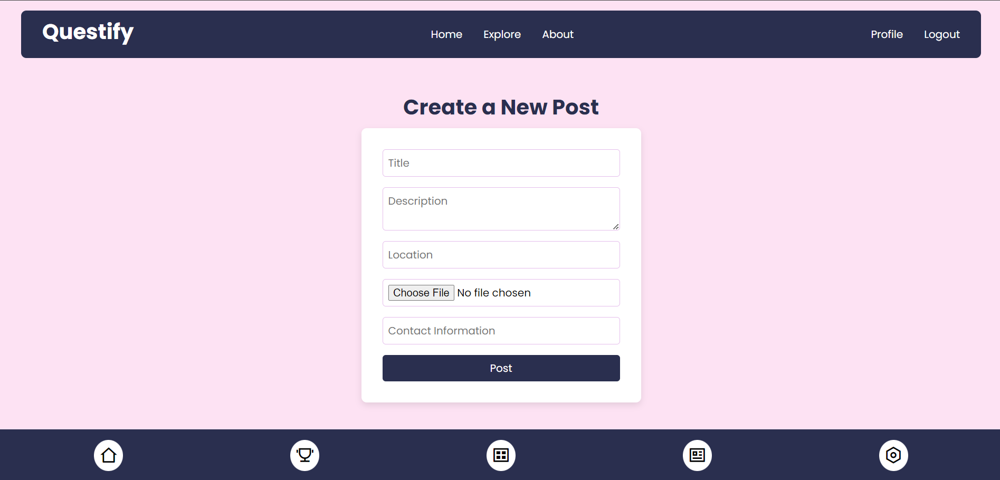
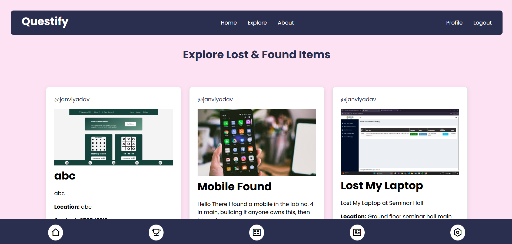

# Questify - Lost and Found



**Questify** is a platform designed to help users post and find lost and found items. Whether it's a misplaced wallet or a found set of keys or anything lost. Questify connects users who have lost or found items with those looking to retrieve them.

## Features



- Post lost or found items with details and images.
- View recent lost and found posts.
- Like (upvote) posts and add comments.
- Contact users who posted the items.
- Easy-to-use forms for posting lost or found items.

## Technology Stack

Questify is built using the:

- **MongoDB**: For storing user data and item posts.
- **Express.js**: As the backend framework.
- **Ejs**: For building dynamic and responsive frontend.
- **Node.js**: Server-side JavaScript runtime.
- **CSS** : Custom CSS styles.

## Future Updates Coming

Upcomig updates in future : Delete posts, Reward System for Users, Ads listings, Promote or Boost Your Posts and etc.

## Project Setup

1. Clone the repository:

   ```bash
   git clone https://github.com/adityadhiman-in/questify.git
   ```

2. Navigate into the project directory:

   ```bash
   cd your-repository-name
   ```

3. Install Dependencies
   ```
   npm i
   ```
4. Start the server
   ```
   node server.js or nodemon server.js
   ```

## Contact

Feel free to reach out if you have any questions or suggestions!

- [Website](https://adityadhiman.in)
- [GitHub](https://github.com/adityadhiman-in)
- [LinkedIn](https://www.linkedin.com/in/adityadhiman-in)

Made with ❤️ by [Aditya Dhiman](https://adityadhiman.in)
